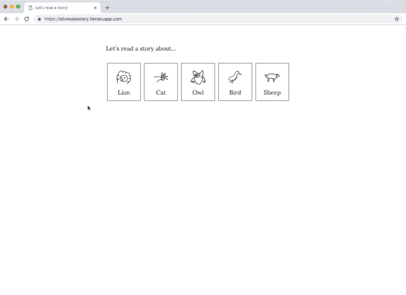
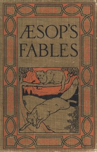

# Let's Read a story!

#### This project is a study on Aesop Fables and the possibility of exploring the connections between them in a new and and fun way using machine learning.




### 📜 Collecting the data.

This project is a study in which I chose to focus and analyze [Aesop Fables](http://www.gutenberg.org/files/49010/49010-0.txt) to produce new and interesting juxtapositions between sentences to create new stories. I was drawn to Aesop Fables texts because of their concise yet rich story lines, the use of animals as metaphors, and the strong morals embedded in each story.



Each original Aesop Fable contains:

1. A short title, usually very descriptive of the story's content and characters.
2. The story itself, usually no more than 30 sentences.
3. The moral of the story, usually contains a metaphor built on the inherent nature or trait of the animals in the story.     

### 🧹 Cleaning the dataset

For the analysis of the content I compiled a [JSON file](https://github.com/itayniv/aesop-fables-stories/blob/master/public/aesopFables.json) file holding all stories broken down to individual sentences, their titles, characters, and animals.

This file is key for generation of new stories, as it holds all sentences and acts as the 'database' for the experiment.

### ⚙️ Analyzing the sentences

Using Google's [Universal Sentence Encoder](https://colab.research.google.com/github/tensorflow/hub/blob/master/examples/colab/semantic_similarity_with_tf_hub_universal_encoder.ipynb), I analyzed all sentences derived from the fables(~1500 sentences).

This yields a JSON file containing sentence embeddings for each sentence in a 512 dimensional space, this is the similarity map I use to compare and generate new juxtapositions.

Example line from the file:

```
{"message": "There was once a little Kid whose growing horns made him think he was a grown-up Billy Goat and able to take care of himself.", "message_embedding": [0.06475523114204407, -0.026618603616952896, -0.05429006740450859, 0.003563014790415764 ...........,0.06475523194004407]}
```


For processing and retrieval of information for similarities, averages and distances between sentences I used the [ML5](https://github.com/ml5js/ml5-library/blob/master/src/Word2vec/index.js) Word2Vec class and [changed it a bit](https://github.com/itayniv/aesop-fables-stories/blob/master/sentence2vec.js) to work with the universal sentence encoder scheme.


### 🎨 Adding Illustrations & 🎵 Musical phrases to the story

To enrich the stories, I'm using [Google Magenta's sketch-RNN model: A Generative Model for Vector Drawings](https://github.com/tensorflow/magenta/tree/master/magenta/models/sketch_rnn)to reconstruct illustrations from a pre trained model to accompany the generated stories.

Using simple RegEx search, the javascript functionality determines which animal appears in the generated story and then draws the illustration from the trained sketch RNN model using [P5](https://p5js.org/). If the sentence contains an animal that does not exist in the model, there is another function that 'enriches' the model's keywords and matches similar animals specified in the sentence.

These illustrations then become musical phrases based on some pre determined rules:

1. With the help of [AFINN-based sentiment analysis library](https://www.npmjs.com/package/sentiment) I analyze each sentence and determine whether it has a positive or negative sentiment. Based on that sentiment (a score between -5 to 5), I'm mapping the illustration's X and Y coodinates to musical notes on a major or minor B scale - positive scores get a major scale 😊 and negative scores get a minor scale 😥.

2. According to the animal appearing in the sentence, I choose a different [tone.js](https://tonejs.github.io/) synthesizer and a different number of musical notes. For example, an predatory animal that tends to be scary, like a wolf, will be played by a low-tone synth and a small amount of musical notes sounds. Conversely, a bird will be played by a high-pitched synth and a higher amount of sounds.

This method, of course, does not purport to represent the story reliably, and there are cases in which there will be no match between the musical sounds and the story, but it gives a certain touch to the story and enriches the characters and illustrations in a somewhat charming way. In future versions this method will need to be improved.
